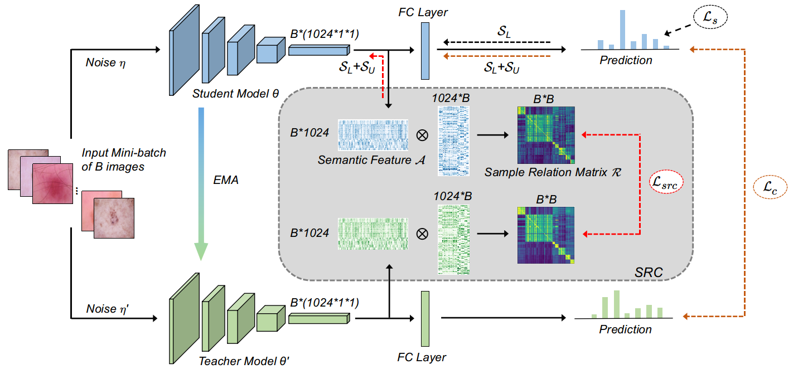

# Semi-supervised Medical Image Classification with Relation-driven  Self-ensembling Model
by [Quande Liu](https://github.com/liuquande), [Lequan Yu](https://yulequan.github.io/), [Luyang Luo](https://www.researchgate.net/profile/Luyang_Luo), [Qi Dou](http://www.cse.cuhk.edu.hk/~qdou/), [Pheng-Ann Heng](http://www.cse.cuhk.edu.hk/~pheng/). 

### Introduction

This repository is for our TMI 2020 paper '[Semi-supervised Medical Image Classification with Relation-driven  Self-ensembling Model](https://github.com/liuquande)'. 



### Installation
This repository is based on PyTorch 1.4.0.

### Usage

1. Clone the repository:

   ```shell
   git clone https://github.com/liuquande/SRC-MT.git
   cd code
   ```

2. Organize the dataset

2. Train the model:
 
   ```shell
   python train_SRC_MT.py --gpu 0,1,2
   ```

## Citation

If this repository is useful for your research, please cite:
```
@article{liu2020semi,
  title={Semi-supervised medical image classification with relation-driven self-ensembling model},
  author={Liu, Quande and Yu, Lequan and Luo, Luyang and Dou, Qi and Heng, Pheng Ann},
  journal={IEEE Transactions on Medical Imaging},
  year={2020},
  publisher={IEEE}
}
```

### Questions

Please contact 'qdliu0226@gmail.com'
